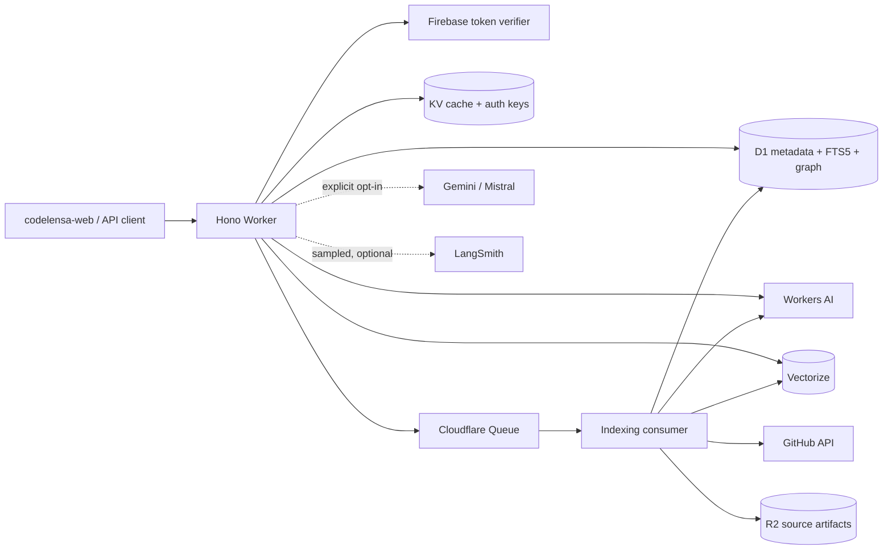
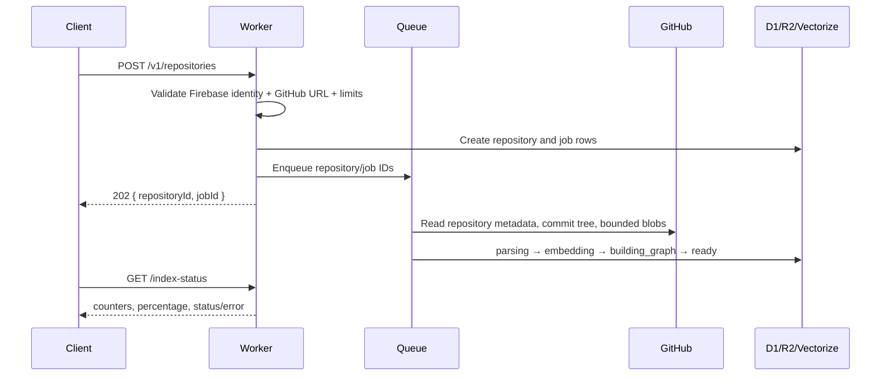
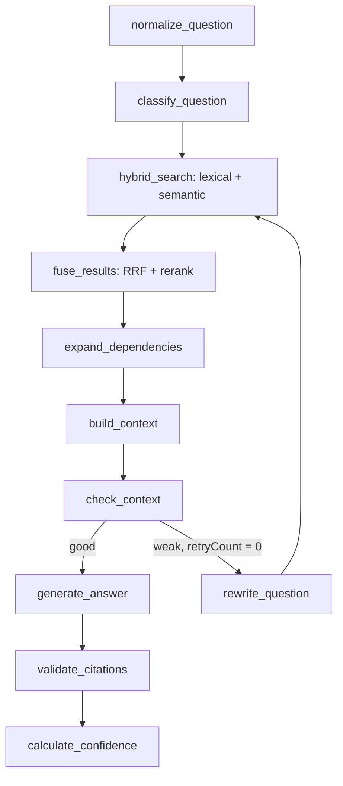
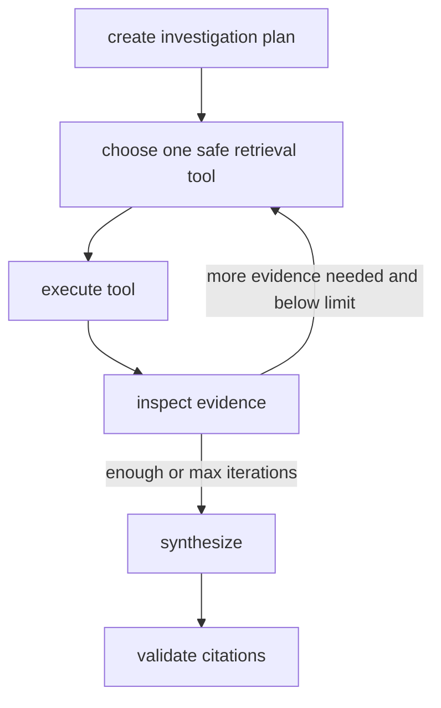

# CodeLensa Core

CodeLensa Core is a Cloudflare-native code intelligence and repository RAG backend. It indexes public GitHub repositories asynchronously, extracts code structure, builds lexical, semantic, and dependency indexes, and answers repository questions with server-verified file/symbol/line citations.

The normal path runs on Workers AI. Gemini and Mistral are optional OpenAI-compatible providers and are never selected unless deployment configuration explicitly allows them. LangSmith is optional, sampled, disabled by default, and not a deployment dependency.

## Architecture



The same Worker exports both `fetch` and Queue consumer handlers. Queue messages contain identifiers only; repository content remains in R2/D1/Vectorize.

## Why CodeLensa is not a basic vector RAG

CodeLensa combines:

- AST-aware semantic chunking around functions, classes, methods, hooks, interfaces, and modules
- exact symbol and FTS5 lexical search in D1
- semantic search in a repository-isolated Vectorize namespace
- bounded dependency expansion over imports, calls, references, inheritance, and test edges
- Reciprocal Rank Fusion plus deterministic code-aware reranking
- context deduplication, line preservation, file diversity, and a hard context budget
- LangGraph query routing and one bounded rewrite/retrieval retry
- server-side citation ownership, chunk, file, context, and line-range verification

Vector metadata contains identifiers and small routing fields, not source payloads. D1 is the authority for resolving a vector to a repository-owned chunk.

## Ingestion flow



Repository fetching uses only fixed `api.github.com` endpoints derived from a validated `https://github.com/<owner>/<repo>` URL. It does not clone, execute code, follow symlinks, or accept arbitrary fetch targets. Binary, generated, vendor, lock, and oversized files are excluded.

### Structural parsing

`TreeSitterCodeParser` loads language WASM grammars from the private R2 bucket under `grammars/`. If a grammar has not been provisioned, the production-safe structural fallback still extracts supported TypeScript, TSX, JavaScript, JSX, and Python declarations without executing code. Both paths emit the same parser contract and AST-aligned chunk metadata.

Large symbols split at line-aware windows with overlap while preserving their symbol and parent metadata. Content hashes provide stable identities for future incremental reuse; the current MVP replaces one repository commit at job granularity.

## RAG LangGraph



Classification starts with deterministic heuristics. Exact-looking symbols favor lexical results; architecture, debugging, impact, and testing questions add dependency traversal. Normal Ask mode permits one initial retrieval and at most one rewritten retrieval.

The generation prompt separates system instructions, the user question, and untrusted repository evidence. Evidence can never override instructions. Answers reference context chunk IDs; the server maps only valid context IDs to file/symbol/line citations and checks each against D1.

## Investigate mode

Investigate is a separate bounded LangGraph loop for cross-module reasoning:



Tools perform data retrieval only: code/symbol search, semantic search, callers/callees/imports/references, related tests, repository structure, and bounded graph expansion. No shell, `eval`, build, test, or repository execution tool exists. `AGENT_MAX_ITERATIONS` is validated and capped at 12; the default is 6.

## Provider architecture

All generation is behind `CodeLensaModelProvider`:

```ts
interface CodeLensaModelProvider {
  id: "cloudflare" | "gemini" | "mistral";
  model: string;
  chat(request: ChatRequest): Promise<ChatResponse>;
  stream(request: ChatRequest): AsyncIterable<ChatChunk>;
  supportsTools: boolean;
  supportsStructuredOutput: boolean;
}
```

- `CloudflareWorkersAIProvider` uses the Workers AI binding and is the default.
- Gemini uses the official `openai` package at Google's OpenAI-compatible endpoint.
- Mistral uses the same package at Mistral's OpenAI-compatible endpoint.
- `ModelRegistry` resolves purpose/provider/model from environment configuration.

Model names are configuration, not promises about availability or cost. Normal RAG never silently sends repository evidence to an external provider. If optional credentials are absent, normal Cloudflare RAG remains available; agent fallback behavior is explicit through `ENABLE_AGENT_FALLBACK`.

## API

All success responses use `{ "data": ... }`; errors use `{ "error": { "code", "message", "details?" } }`.

```text
GET    /health
GET    /v1/models
GET    /v1/usage
POST   /v1/repositories
GET    /v1/repositories
GET    /v1/repositories/:id
DELETE /v1/repositories/:id
GET    /v1/repositories/:id/index-status
POST   /v1/repositories/:id/reindex
POST   /v1/repositories/:id/search
POST   /v1/repositories/:id/chat
POST   /v1/repositories/:id/chat/stream
GET    /v1/repositories/:id/files
GET    /v1/repositories/:id/files/:fileId
GET    /v1/repositories/:id/symbols
GET    /v1/repositories/:id/symbols/:symbolId
GET    /v1/repositories/:id/graph
GET    /v1/repositories/:id/graph/symbol/:symbolId
GET    /v1/repositories/:id/evaluations
POST   /v1/evaluations/run
GET    /v1/evaluations/:runId
```

`POST /chat/stream` emits SSE events: `retrieval_started`, `retrieval_completed`, `progress` (Investigate only), `generation_started`, `token`, `citation`, `completed`, and `error`. It never streams model reasoning.

## Local development

Requirements: Node.js 20+ and a Cloudflare account for remote AI/Vectorize use. No Ollama or local LLM is required.

```bash
npm install
cp .env.example .dev.vars
npm run cf-types
npm run dev
npm test
npm run test:integration
npm run lint
npm run typecheck
```

Wrangler simulates D1, KV, R2, and Queues locally. Workers AI is configured as a remote binding; semantic search also requires a real Vectorize index. Deterministic parsing, lexical retrieval components, fusion, reranking, citations, routing, and evaluation metrics have no live-AI dependency in unit tests.

Apply local migrations:

```bash
npx wrangler d1 migrations apply codelensa --local
```

## Cloudflare provisioning

Create resources once, then replace the placeholder IDs in `wrangler.jsonc`:

```bash
npx wrangler d1 create codelensa
npx wrangler r2 bucket create codelensa-repositories
npx wrangler kv namespace create CACHE
npx wrangler queues create codelensa-indexing
npx wrangler queues create codelensa-indexing-dlq
npx wrangler vectorize create codelensa-code --dimensions 768 --metric cosine
```

The default `@cf/baai/bge-base-en-v1.5` embedding configuration uses 768 dimensions. If the embedding model changes, create a matching index and update both `CLOUDFLARE_EMBEDDING_MODEL` and the Vectorize binding. The namespace is the repository ID, providing a hard query partition in addition to D1 ownership checks.

Apply production migrations and validate binding types:

```bash
npx wrangler d1 migrations apply codelensa --remote
npm run cf-types
```

### Tree-sitter grammars

Build or obtain Worker-compatible Tree-sitter WASM grammars from the upstream language grammar projects, verify their checksums, and upload them to the private bucket:

```bash
npx wrangler r2 object put codelensa-repositories/grammars/web-tree-sitter.wasm --file ./node_modules/web-tree-sitter/web-tree-sitter.wasm
npx wrangler r2 object put codelensa-repositories/grammars/tree-sitter-typescript.wasm --file ./grammars/tree-sitter-typescript.wasm
npx wrangler r2 object put codelensa-repositories/grammars/tree-sitter-tsx.wasm --file ./grammars/tree-sitter-tsx.wasm
npx wrangler r2 object put codelensa-repositories/grammars/tree-sitter-javascript.wasm --file ./grammars/tree-sitter-javascript.wasm
npx wrangler r2 object put codelensa-repositories/grammars/tree-sitter-python.wasm --file ./grammars/tree-sitter-python.wasm
```

Do not put secret values in `wrangler.jsonc`. Configure them interactively:

```bash
npx wrangler secret put FIREBASE_PROJECT_ID
npx wrangler secret put GITHUB_TOKEN
# Optional only:
npx wrangler secret put GEMINI_API_KEY
npx wrangler secret put MISTRAL_API_KEY
npx wrangler secret put LANGSMITH_API_KEY
```

`GITHUB_TOKEN` is optional for public repositories but raises GitHub API rate capacity. It is never logged.

## Firebase

Create a Firebase project and enable the desired sign-in providers. Set `FIREBASE_PROJECT_ID` on the Worker and configure the same project in the frontend. The backend validates RS256 signatures against Google's rotating JWK set, caches keys in KV, and verifies issuer, audience, expiry, issued-at, and subject claims. Frontend user IDs are ignored.

Anonymous callers can list/query only rows marked `is_demo = 1`. Custom repository creation, deletion, reindexing, and evaluation runs require authentication.

## Optional Gemini and Mistral

Gemini:

```dotenv
ENABLE_EXTERNAL_AGENT=true
AGENT_PROVIDER=gemini
GEMINI_MODEL=<model available to your account>
GEMINI_API_KEY=<secret>
```

Mistral:

```dotenv
ENABLE_EXTERNAL_AGENT=true
AGENT_PROVIDER=mistral
MISTRAL_MODEL=<model available to your account>
MISTRAL_API_KEY=<secret>
```

External allocation and pricing change. CodeLensa does not assume any external model is permanently free.

## Optional LangSmith

```dotenv
LANGSMITH_TRACING=true
LANGSMITH_PROJECT=codelensa
LANGSMITH_SAMPLE_RATE=0.05
LANGSMITH_API_KEY=<secret>
```

Tracing is off by default. When enabled, cryptographic sampling controls volume. The integration records the question and aggregate retrieval/output metrics, not raw repository context, which limits code disclosure and trace cost. The application continues normally if tracing is disabled.

## Evaluation

Insert evaluation cases with expected files/symbols into `evaluation_cases`, then run one of:

```json
{
  "repositoryId": "<uuid>",
  "strategy": "hybrid_graph_rerank"
}
```

Supported experiments are `vector`, `lexical`, `hybrid`, `hybrid_graph`, and `hybrid_graph_rerank`. Runs calculate deterministic Recall@1/5/10, MRR, NDCG, file hit rate, and symbol hit rate. Evaluation results and ingestion counts expose portfolio metrics including indexed files/symbols/chunks/edges and retrieval quality. Chat responses expose retrieval confidence and retrieval/generation/total timing fields.

## Security model

- Zod validates bodies, params, configuration, GitHub responses, model output envelopes, and token claims.
- Repository ownership is checked before every repository-scoped operation.
- Vectorize uses a repository namespace; D1 resolution repeats repository filtering.
- GitHub URL validation rejects alternate hosts, credentials, ports, non-HTTPS schemes, and extra path components.
- File, repository, chunk, graph-depth, request-body, and agent-iteration limits are enforced.
- Repository text is untrusted, explicitly delimited evidence. It cannot select arbitrary tools or override prompts.
- Repository code is never built, imported, evaluated, or executed.
- R2 keys are resolved through an owned D1 file row and are never accepted from clients.
- Firebase keys are cached; API keys are secret bindings and are neither persisted nor logged.
- CORS allows only `FRONTEND_URL`.

## Cost controls

- Queue-based ingestion keeps expensive work off request paths and provides retries/DLQ handling.
- Per-user repository limits and daily anonymous/authenticated query quotas are D1-backed.
- Content hashes support reuse decisions; duplicate repositories per owner are rejected.
- Embeddings are batched; retrieval reranking is deterministic and uses no extra model.
- Retrieval results are cached in KV with repository ID, commit SHA, normalized query, retrieval version, strategy, and model in the key.
- LangSmith sampling defaults to zero and external providers default to disabled.
- Workers AI capacity errors become `AI_DAILY_CAPACITY_REACHED`; no automatic paid-provider switch occurs.

## Deployment

After provisioning resources, secrets, grammars, and migrations:

```bash
npm run check
npx wrangler check startup
npx wrangler deploy --dry-run
npx wrangler deploy
```

Set real `FRONTEND_URL` and model variables per environment. Use separate D1, R2, KV, Vectorize, and Queue resources for staging and production.

## Known limitations

- The MVP supports public GitHub repositories only; private GitHub and ZIP adapters are not exposed yet.
- GitHub recursive trees that the API marks truncated are rejected rather than partially indexed.
- Cross-file calls are statically inferred and confidence-scored, not guaranteed type-resolved.
- Tree-sitter grammar WASM files are deployment assets and must be provisioned separately; a structural fallback keeps indexing functional.
- Reindexing currently replaces the repository snapshot. Hashes are stored for a future commit-diff planner, but unchanged vectors are not yet copied across commit namespaces.
- D1 FTS5 is practical lexical ranking, not a distributed Elasticsearch replacement.
- Evaluation generation faithfulness remains a future optional judge; deterministic retrieval and citation metrics are implemented now.

## Roadmap

- GitHub App installation and private repository ingestion
- ZIP ingestion with streaming archive validation
- commit-diff incremental indexing and cross-commit embedding reuse
- more Tree-sitter grammars and deeper type-aware reference resolution
- git history/commit investigation tools
- encrypted ephemeral BYOK session tokens
- deterministic claim-to-citation coverage and optional sampled model-judge experiments
- separate queue stages or Workflows for very large repositories
